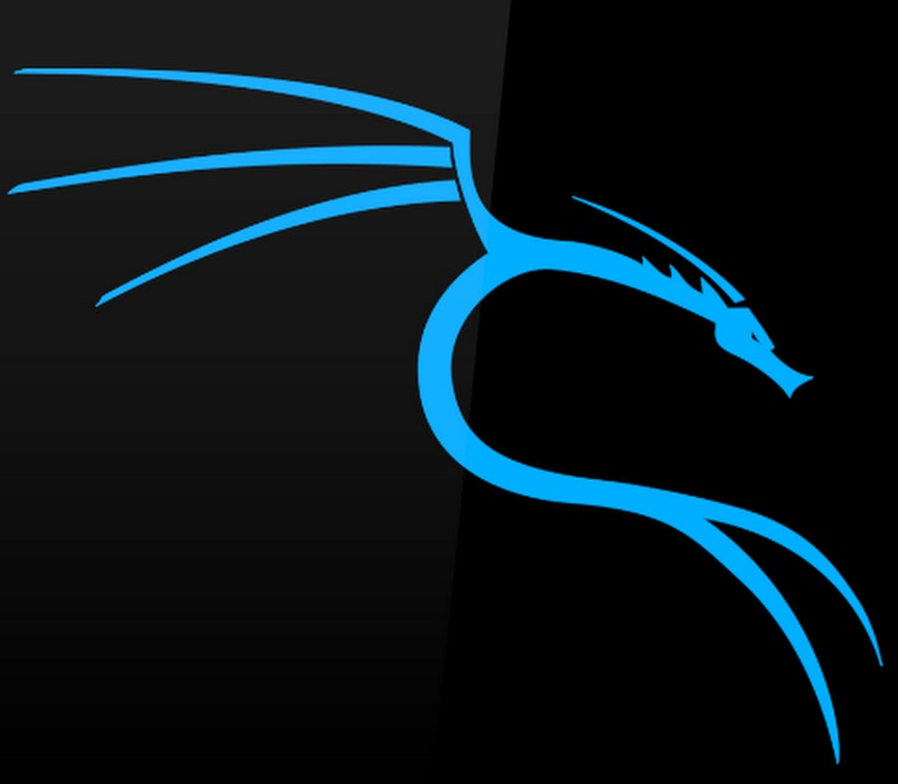

# 💻 Dezly - Systems
_______________________________________________________________________________

### About

My systems are configured for the purpose of `🔧 Software Engineering` 
and `🕵 Ethical Hacking`.

I believe that the two are inseparable. Each one sharpens the skills in the 
other and gives a well-rounded perspective to the tech world.
_______________________________________________________________________________

### Primary Operating System: NixOS

- Declarative system configuration
- Easy to reproduce my setup on a new install of NixOS
- Consistency of development environment across NixOS systems
- Allows me to disable a specific setting or config module by turning it
into a comment
- Allows me to experiement with the latest software packages safely

**Software Engineering**

If you are `building` things, you should also be learning how to `secure` what
you have built from threat actors. I never want to be a software engineer who
just blindly copies and pastes code from tutorials and AI without having an
understanding of what that code is doing.
_______________________________________________________________________________

### Secondary Operating System: Kali Linux

- Comes with pre-installed software packages for ethical hacking
- It is based on Debian testing, so it is good for learning how regular 
Linux systems work.
- Kali is usually run as a virtual machine, it is not intended for daily use
so it gives me experience with virtual machines.

**Ethical Hacking**

If you're trying to proactively `hack` an app or system, 
then you need to understand the `potential flaws` that a software engineer 
could make or things that they could forget to secure.

_______________________________________________________________________________
